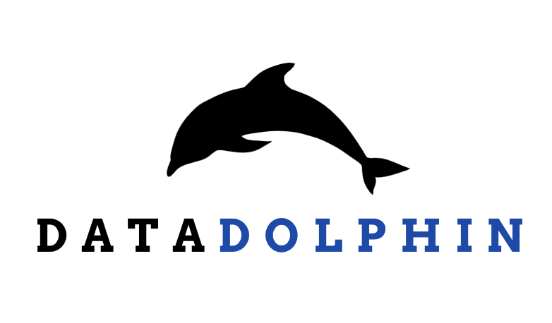

  

We specialize in creating sophisticated data applications. Our team leverages cutting-edge technologies to develop and operate our proprietary software, focusing on data engineering and data science innovations.

## Who We Are

DataDolphin PTE. LTD. pioneers advanced data engineering and data science applications. We combine deep technical expertise with innovative approaches to build powerful tools for data transformation, analysis, and AI-driven insights.

## Services We Offer

- **Application Development**: Design and development of custom data applications for web and mobile platforms
- **Consultancy Services**: Providing expert advice and implementation services in data engineering and data science
- **Training and Support**: Offering comprehensive training sessions and continuous support for AI and data science integrations

## Our Technology & Approach

Our applications are built on a foundation of robust and modern technologies:

- **AI and Machine Learning**: Powering our applications with cutting-edge AI and Machine Learning models, trained and operated for precision and efficiency.
- **LLM Prompt Design & Integration**: Integrating Large Language Models (LLMs) through meticulous prompt design and the development of intelligent AI agents within our software.
- **App Development**: Developing intuitive and responsive cross-platform AI applications for Android, iOS, and web using Flutter.
- **ETL Processes**: Employing robust ETL processes using tools like Airflow and DBT to manage and refine the data that powers our applications.
- **Data Programming**: Utilizing advanced Python and SQL for complex data manipulation, analytics, and backend development of our platforms.
- **Data Processing**: Implementing efficient streaming and batch data processing to ensure our applications handle diverse data workflows seamlessly.
- **Google Cloud Platform**: Leveraging Google Cloud Platform (GCP) to build scalable and reliable cloud infrastructure for our applications.

## Contact Us

Have questions about our products or want to learn more? We'd love to hear from you.

**Email**: 

---

  DataDolphin PTE. LTD. © 2025 | <a href="/privacy-policy">Privacy Policy</a> |  <a href="/terms-of-use">Terms of Use</a>

